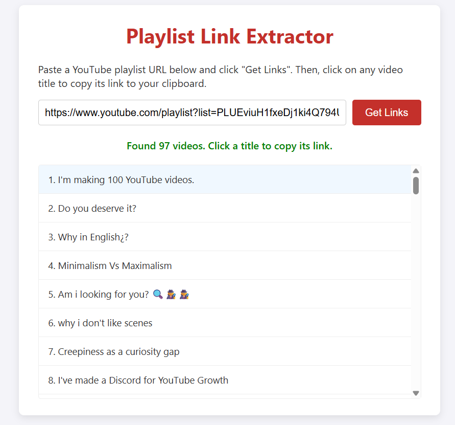

# YouTube Playlist Link Extractor

A simple, self-contained, and privacy-friendly web tool to extract all video links from a public YouTube playlist. Get a clean list of all video URLs and copy any link to your clipboard with a single click.

> **Note:** This is a fork of the original project with significant improvements and bug fixes.

## 🌐 Live Demo

- **Cloudflare Pages:** Deploy your own instance using the instructions below
- **GitHub Pages:** Available at [your-username.github.io/YoutubePlaylistExtractor](https://pages.github.com/)



## 🔄 Fork Modifications

This fork includes several important improvements over the original version:

### 🐛 **Bug Fixes:**
- **Fixed non-functional API calls:** The original version relied solely on Piped API instances that were frequently down or unavailable
- **Improved reliability:** Switched primary backend to Invidious API (more stable than Piped)
- **Automatic failover system:** Implemented smart fallback across 6 different API instances

### ✨ **New Features:**
- **"Copy All Links" button:** Quickly copy all video URLs at once with line breaks between them - perfect for batch downloading or processing
- **Dark theme:** Modern dark blue and gray color scheme for better viewing comfort
- **Direct + Proxy strategy:** Attempts direct API connection first, falls back to CORS proxy only when needed (faster performance)
- **Better error handling:** More informative error messages and improved console logging for troubleshooting

### 🔧 **Technical Improvements:**
- Multiple Invidious instances with automatic rotation
- Optimized API request flow for better performance
- Enhanced user feedback during playlist fetching
- Cleaner code structure and better documentation
- Cloudflare Pages/Workers ready deployment

## ✨ Features

-   **Simple Interface:** Just paste a playlist URL and click a button.
-   **Click to Copy:** Click on any video title in the generated list to instantly copy its URL to your clipboard.
-   **Copy All Links:** New button to copy all video links at once, separated by line breaks - perfect for batch processing!
-   **Visual Feedback:** A "Copied!" message confirms that the link has been copied.
-   **No API Keys Needed:** Uses a public, privacy-focused API so you don't need to register for a Google/YouTube API key.
-   **No Backend Required:** Everything runs directly in your browser. It's a single `html` file.
-   **Portable:** Save the file and use it offline or host it easily on services like GitHub Pages.

## 🚀 How to Use

### Option 1: Use it Locally
1.  **Get the file:** Download the `index.html` file from this repository.
2.  **Open it:** Open the `index.html` file in any modern web browser (like Chrome, Firefox, or Edge).
3.  **Paste your link:** Find a public YouTube playlist and copy its URL. Paste it into the input box.
    -   Example URL: `https://www.youtube.com/playlist?list=PLUEviuH1fxeDj1ki4Q794UV-WKcoHR42A`
4.  **Get Links:** Click the "Get Links" button.
5.  **Copy!** The list of video titles will appear. Just click on any title to copy the full video link.

### Option 2: Deploy to Cloudflare Pages
See the [Deployment section](#-deployment-to-cloudflare-pages) below for detailed instructions.

## ⚙️ How It Works (The Technical Part)

This tool is built with vanilla HTML, CSS, and JavaScript.

A web browser's security rules (**CORS Policy**) prevent a script from one domain (like your local file) from requesting data from another domain (like `youtube.com`). Trying to scrape YouTube directly would fail.

To get around this, the tool uses a clever, two-step process:

1.  **Privacy-Friendly APIs:** Instead of scraping YouTube directly, it sends requests to public instances of privacy-friendly YouTube frontends:
    - **Invidious API** (primary): Multiple instances like `inv.nadeko.net`, `invidious.jing.rocks`, etc.
    - **Piped API** (fallback): Backup instances if Invidious is unavailable.
    
    These services provide clean JSON responses with all the playlist information, without needing an official API key.

2.  **CORS Proxy:** Even public APIs restrict requests that come from a local file (`origin: null`). To solve this, requests are routed through the **AllOrigins** CORS proxy. This proxy fetches the data on our behalf and adds the necessary headers to the response, satisfying the browser's security policy.

3.  **Automatic Failover:** The tool automatically tries multiple API instances in order. If one server is down, it seamlessly moves to the next, ensuring maximum reliability.

The data flow looks like this:
`Your Browser` → `AllOrigins Proxy` → `Invidious/Piped API` → `AllOrigins Proxy` → `Your Browser`

This approach ensures the tool works reliably without complex setups or security vulnerabilities.

## 🚀 Deployment to Cloudflare Pages

This project is optimized for deployment on Cloudflare Pages, which offers free hosting with excellent global performance.

### Prerequisites
- A GitHub account
- A Cloudflare account (free tier is sufficient)

### Method 1: Deploy via Cloudflare Dashboard (Recommended)

1. **Push to GitHub:**
   ```bash
   git add .
   git commit -m "Prepare for Cloudflare Pages deployment"
   git push origin main
   ```

2. **Connect to Cloudflare Pages:**
   - Go to [Cloudflare Dashboard](https://dash.cloudflare.com/)
   - Navigate to **Workers & Pages** → **Pages**
   - Click **Create a project** → **Connect to Git**
   - Select your GitHub repository: `YoutubePlaylistExtractor`

3. **Configure Build Settings:**
   - **Project name:** `youtube-playlist-extractor` (or your preferred name)
   - **Production branch:** `main`
   - **Build command:** Leave empty (no build needed)
   - **Build output directory:** `/` (root directory)
   - Click **Save and Deploy**

4. **Access Your Site:**
   - Your site will be available at: `https://youtube-playlist-extractor.pages.dev`
   - You can also add a custom domain in the Pages settings

### Method 2: Deploy via Wrangler CLI

1. **Install Wrangler:**
   ```bash
   npm install -g wrangler
   # or
   npm install
   ```

2. **Login to Cloudflare:**
   ```bash
   wrangler login
   ```

3. **Deploy:**
   ```bash
   npm run deploy
   # or
   wrangler pages deploy .
   ```

4. **View Deployments:**
   ```bash
   npm run preview
   ```

### Environment Configuration

The project includes:
- `wrangler.toml`: Cloudflare Pages configuration
- `_headers`: Security headers and CORS policy
- `.gitignore`: Excludes unnecessary files from deployment
- `package.json`: npm scripts for easy deployment

### Automatic Deployments

Once connected to GitHub, Cloudflare Pages will automatically:
- Deploy on every push to the `main` branch
- Create preview deployments for pull requests
- Provide deployment status and logs

### Custom Domain (Optional)

To use a custom domain:
1. Go to your Pages project settings
2. Click **Custom domains**
3. Add your domain and follow the DNS configuration instructions


## 📄 License

This project is open-source and available under the [MIT License](LICENSE). See the `LICENSE` file for more details.
